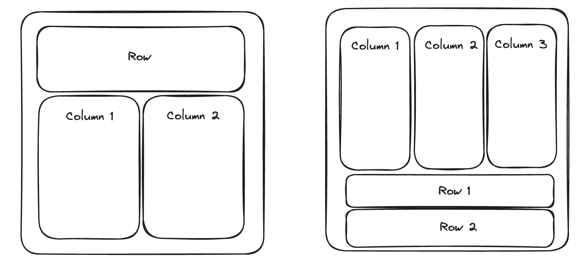

# HW06
## Soft deadline: 23:59 20.11.2024
## Hard deadline: 23:59 27.11.2024

### Task description
You are developing UI Framework in Haskell. Your main goal is to provide convinient tool for developing simple pages in Haskell and then easily convert them into HTML page.


Requirements:
* DSL + Interpreter approach
* Designed as a module, strick export policy (with smart constructors)

1. (4 points)  
* Design and implement DSL for this task to support such UI elements:
    * Title line
    * Paragraph
    * Images
    * Links
    * Ordered list
    * Unordered list
    * Input form
    * Button 

* Resentation of document can be any: like only block-elements, like only flex-box elements or any what you like

* By clicking on Button element data with the values of inputs should be sent to the some server [POST-query] [see native html forms, button could be converted to html input with type="submit"]

* Implement interpreter to convert DSL of actions to HTML-file [no need to support JS, of course]

2. (2 points) Modify DSL to eDSL with the use of Free Monad 

3. (2 points - basic, extra 4 points - advanced) Modify DSL to support different Columns and Rows. 

* You can implement it with the help of "style" html tag and css-property flex-box. Your updated DSL should support the following desings below:



* Basic (2 points): 
    - refactor eDSL based on Free Monad
    - provide such eDSL not to modify Free Monad to some other Monads

* Advanced (extra 4 points): 
    - modify eDSL based on Free Monad to eDSL based on ... Monad
    - ... could be anything, depending on your eDSL format. For example, State Monad can be used to achive such eDSL:

    ```
    script = do
        startSplittingToColumns 2
        addTitleElement "Column 1 Header"
        addTitleElement "Column 2 Header"
        endSplittingToColumns
        addOrderedList 1 "Some point"
    ```
